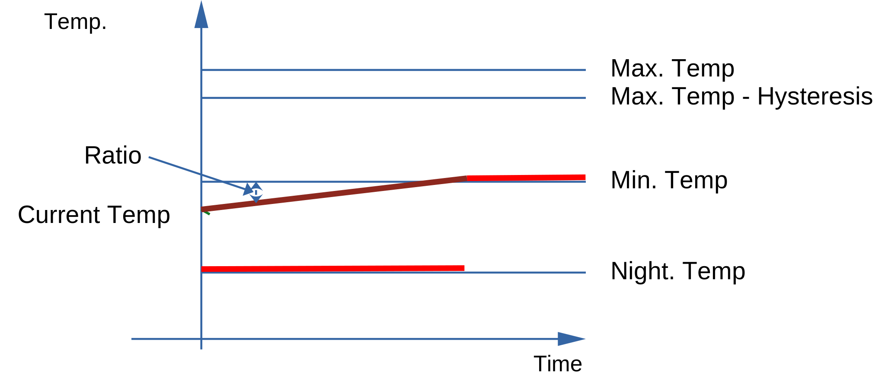
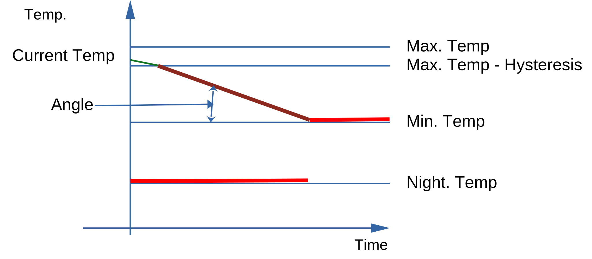

# Cost Simulation

## Basic Concept

The costs for heating depend on when and at which price the heating needs to be enabled. The simulation will try to calculate the costs for different scenarios.

It will consider night, minimum and maximum temperatures as limits.

**If the number of periods is high, this approach leads to very long processing times!!!**
So, this approach is not practicable.

## The result 

The result of the simulation is whether the estimated heating costs are lower when heating is on or off for the current hour.

## Assumptions
For the simulation of this process, there are several assumptions:
1. The current temperature will decrease at a given rate. The rate may depend on the outer temperature and the design temperature (Heating node) or it is fixed (Hotwater node)
2. Outer temperature is fixed during simulation time
3. When heating is enabled, the current temperature will grow at a fixed rate
4. The minimal temperature depends on the period (night/day)
4. The simulation will be done every hour(period)

## Finding the time limits

The simulation will "try" heating on and off for every hour in the prognosis range.
If the range is large, the simulation takes (very) long
The number of simulation can be calculated by 
```
2 ^ (number of periods in the prognosis range)
```
So for 48 hours there are more than 10^12 simulations to be done. This would take too long.
That why the limits need to be calculated first.
### Finding the most critical period
The most critical period is the one with the steepest **ratio** from ```( minimal temperature - current temperature)/number of periods```.



This ratio can also be negative if the current temperature is higher than the minimum temperature.



So, the first step is to calculate this ratio for the complete prognosis range.

The period with the largest ratio is the last period in the simulation range.
### Finding the simulation range
Another limit is the maximum number of non heating periods. This can be calculated as ``` (current temperature - night temperature )/(cool down temperature per hour) ```

If there is no night temperature configured in the period range, the minimum temperature it calculates as
``` (current temperature - minimum temperature )/(cool down temperature per hour) ```

The last limit is the maximum number of allowed periods. It is a fixed number.

A too large maximum will lead to long simulation execution times.

So, the simulation range is the minimum of
1. The most critical period,
2. Maximum number of heating periods
3. Fixed maximum of periods

### Starting Point for simulation
Usually the simulation starts at **first period** in prognosis period.

However, if the ```current temperature >= maximum temperature -hysteresis```, the simulations starts when the ```current temperature < maximum temperature -hysteresis```

## Paralell Execution

The simulation can be executed in paralell. However, there are two restriction:

1. Nodejs doesn't support multithreading
2. A lot of simulation steps will return with no solution. This might reduce the number of simulation steps.

So, for now, there is no paralell processing implemented
